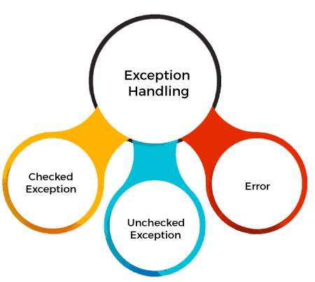

=  1.Fundamentals

== Basic Syntax
---
Data Types are divided into two group

Primitive - byte,short,int,long,float,double,boolean and char
Non-Primitive - String, Arrays, Classes, Enums and Records

An enum type is a special data type that enables for a variable to be a set of predefined constants.

```
public enum Day {
    SUNDAY, MONDAY, TUESDAY, WEDNESDAY,
    THURSDAY, FRIDAY, SATURDAY
}
```

Records are immutable data classes that require only the type and name of fields.
The equals, hashCode, and toString methods, as well as the private, final fields and public constructor, are generated by the Java compiler.

```
public record Person (String name, String address) {}
```

== OOP
---
Object-oriented programming (OOP) is a programming paradigm based on the concept of objects, which can contain data and code: data in the form of fields (often known as attributes or properties), and code in the form of procedures (often known as methods). In OOP, computer programs are designed by making them out of objects that interact with one another.

Abstraction, encapsulation, polymorphism, and inheritance are the four main theoretical principles of object-oriented programming. But Java also works with three further OOP concepts: association, aggregation, and composition.

---
== Class
---
=== What is an object in Java?
An object is a real-word entity that has state and behaviour. In other words, an object is a tangible thing that can be touch and feel, like a car or chair, etc. are the example of objects. The banking system is an example of an intangible object. Every object has a distinct identity, which is usually implemented by a unique ID that the JVM uses internally for identification.

==== Characteristics of an Object:
- *State*: It represents the data (value) of an object.
- *Behavior*: It represents the behavior (functionality) of an object such as deposit, withdraw, etc.
- *Identity*: An object's identity is typically implemented via a unique ID. The ID's value is not visible to the external user; however, it is used internally by the JVM to identify each object uniquely.

*An object is an instance of a class*. A class is a template or blueprint from which objects are created. So, an object is the instance(result) of a class.

==== Object Definitions:

- An object is a real-world entity.
- An object is a runtime entity.
- The object is an entity which has state and behavior.
- The object is an instance of a class.


=== What is a Class in Java?
A class is a group of objects which have common properties. It is a template or blueprint from which objects are created. It is a logical entity. It can't be physical.

A class in Java can contain:

*1. Fields*

Variables stated inside a class that indicate the status of objects formed from that class are called fields, sometimes referred to as instance variables. They specify the data that will be stored in each class object. Different access modifiers, such as public, private, and protected, can be applied to fields to regulate their visibility and usability.

*2. Methods*

Methods are functions defined inside a class that includes the actions or behaviors that objects of that class are capable of performing. These techniques allow the outside world to function and change the object's state (fields). Additionally, methods can be void (that is, they return nothing) or have different access modifiers. They can also return values.

*3. Constructors*

Constructors are unique methods that are used to initialize class objects. When an object of the class is created using the new keyword, they are called with the same name as the class. Constructors can initialize the fields of an object or carry out any additional setup that's required when an object is created.

*4. Blocks*

Within a class, Java allows two different kinds of blocks: instance blocks, commonly referred to as initialization blocks and static blocks. Static blocks, which are usually used for static initialization, are only executed once when the class is loaded into memory. Instance blocks can be used to initialize instance variables and are executed each time a class object is generated.

*5. Nested Class and Interface*

Java permits the nesting of classes and interfaces inside other classes and interfaces. The members (fields, methods) of the enclosing class are accessible to nested classes, which can be static or non-static. Nested interfaces can be used to logically group related constants and methods together because they are implicitly static.

=== What are the different ways to create an object in Java?
There are the following ways to create an object in Java.

*1. By new keyword*

The most common way to create an object in Java is by using the new keyword followed by a constructor.

For example: ClassName obj = new ClassName();. This allocates memory for the object and calls its constructor to initialize it.

*2. By newInstance() method*

This method is part of the java.lang.Class class and is used to create a new instance of a class dynamically at runtime. It invokes the no-argument constructor of the class.

For example: ClassName obj = (ClassName) Class.forName("ClassName").newInstance();.

*3. By clone() method*

The clone() method creates a copy of an existing object by performing a shallow copy. It returns a new object that is a duplicate of the original object.

For example: ClassName obj2 = (ClassName) obj1.clone();.

*4. By deserialization*

Objects can be created by deserializing them from a stream of bytes. This is achieved using the ObjectInputStream class in Java. The serialized object is read from a file or network, and then the readObject() method is called to recreate the object.

*5. By factory method*

Factory methods are static methods within a class that return instances of the class. They provide a way to create objects without directly invoking a constructor and can be used to encapsulate object creation logic.

For example: ClassName obj = ClassName.createInstance().

== Inheritance in Java
---
Inheritance in Java is a mechanism in which one object acquires all the properties and behaviors of a parent object. It is an important part of OOPs (Object Oriented programming system).

The idea behind inheritance in Java is that we can create new classes that are built upon existing classes. When we inherit methods from an existing class, we can reuse methods and fields of the parent class. However, we can add new methods and fields in your current class also.

=== What is Inheritance?
Inheritance in Java enables a class to inherit properties and actions from another class, called a superclass or parent class. A class derived from a superclass is called a subclass or child group. Through inheritance, a subclass can access members of its superclass (fields and methods), enforce reuse rules, and encourage hierarchy.

Inheritance represents the IS-A relationship which is also known as a parent-child relationship.

=== Why use inheritance in Java?
- For Method Overriding (so runtime polymorphism can be achieved).
- For Code Reusability.

==== The syntax of Java Inheritance
[, java]
----
class Subclass-name extends Superclass-name
{
   //methods and fields
}
----

==== Types of Inheritance in Java
On the basis of class, there can be three types of inheritance in java: single, multilevel and hierarchical.

In java programming, multiple and hybrid inheritance is supported through interface only.

image::img1.jpg[]
image::img2.jpg[]

==== Single Inheritance Example

When a class inherits another class, it is known as a single inheritance. In the example given below, Dog class inherits the Animal class, so there is the single inheritance.

[,java]
----
class Animal{
    void eat(){System.out.println("eating...");}
}
class Dog extends Animal{
    void bark(){System.out.println("barking...");}
}
class TestInheritance{
    public static void main(String args[]){
        Dog d=new Dog();
        d.bark();
        d.eat();
    }
}
----

Output:

[,]
----
barking...
eating...
----

==== Multilevel Inheritance Example
When there is a chain of inheritance, it is known as multilevel inheritance. As you can see in the example given below, BabyDog class inherits the Dog class which again inherits the Animal class, so there is a multilevel inheritance.

[,java]
----
class Animal{
    void eat(){System.out.println("eating...");}
}
class Dog extends Animal{
    void bark(){System.out.println("barking...");}
}
class BabyDog extends Dog{
    void weep(){System.out.println("weeping...");}
}
class TestInheritance2{
    public static void main(String args[]){
        BabyDog d=new BabyDog();
        d.weep();
        d.bark();
        d.eat();
    }
}
----
Output:

[,]
----
weeping...
barking...
eating...
----

==== Hierarchical Inheritance Example
When two or more classes inherits a single class, it is known as hierarchical inheritance. In the example given below, Dog and Cat classes inherits the Animal class, so there is hierarchical inheritance.

[,java]
----
class Animal{
    void eat(){System.out.println("eating...");}
}
class Dog extends Animal{
    void bark(){System.out.println("barking...");}
}
class Cat extends Animal{
    void meow(){System.out.println("meowing...");}
}
class TestInheritance3{
    public static void main(String args[]){
        Cat c=new Cat();
        c.meow();
        c.eat();
        //c.bark();//C.T.Error
    }
}
----

Output:
[,]
----
meowing...
eating...
----

=== Why multiple inheritance is not supported in Java?
To reduce the complexity and simplify the language, multiple inheritance is not supported in java.

Suppose there are three classes A, B, and C. The C class inherits A and B classes. If A and B classes have the same method and we call it from child class object, there will be ambiguity to call the method of A or B class.

Since compile-time errors are better than runtime errors, Java renders compile-time error if you inherit 2 classes. So whether you have same method or different, there will be compile time error.

Java supports multiple inheritance through interfaces, where a class can implement multiple interfaces.

[,java]
----
interface A {
    default void methodA() {
        System.out.println("Method A from interface A");
    }
}
// Interface B
interface B {
    default void methodB() {
        System.out.println("Method B from interface B");
    }
}
// Class implementing both interfaces A and B
class MyClass implements A, B {
    public void myMethod() {
        System.out.println("My method in MyClass");
    }
}
public class MultipleInheritanceDemo {
    public static void main(String[] args) {
        // Creating an object of MyClass
        MyClass obj = new MyClass();
        // Calling methods from both interfaces
        obj.methodA();
        obj.methodB();
        // Calling method defined in MyClass
        obj.myMethod();
    }
}
----
Output:
[,]
----
Method A from interface A
Method B from interface B
My method in MyClass
----
In this example, MyClass implements both interfaces A and B, allowing it to inherit methods from both interfaces. This demonstrates the concept of achieving multiple inheritance in Java through interfaces.

==== Benefits of Inheritance
Inheritance offers several advantages, including:

*Code Reusability:* Inherited members from a superclass can be reused in subclasses, reducing redundant code and promoting a modular approach to software development.

*Hierarchical Organization:* Inheritance facilitates the creation of well-structured class hierarchies, improving code readability and maintainability.

*Polymorphism:* Subclasses can override superclass methods, allowing for polymorphic behavior, where methods can behave differently based on the object type at runtime.

*Easier Maintenance:* Changes made to a superclass automatically propagate to its subclasses, ensuring consistency and simplifying maintenance efforts.

==== Best Practices for Using Inheritance
While inheritance is a powerful tool, its misuse can lead to code complexity and tight coupling.

Here are some best practices to consider:

*Favor Composition Over Inheritance:* When possible, prefer composition, where classes are composed of other classes, over inheritance. This approach often leads to more flexible and maintainable code.

*Follow the "is-a" Relationship:* Ensure that inheritance relationships adhere to the "is-a" principle, where a subclass represents a more specialized version of its superclass.

*Use Abstract Classes and Interfaces Wisely:* Abstract classes and interfaces provide blueprints for subclasses. Use abstract classes when you want to provide a default implementation or share code among related subclasses. Use interfaces to define contracts that classes can implement, enabling multiple inheritance through interfaces.

*Avoid Deep Inheritance Hierarchies:* Deep inheritance hierarchies can make code difficult to understand and maintain. Aim for shallow hierarchies whenever possible.

*Prefer Composition for Code Reuse:* Instead of relying solely on inheritance for code reuse, consider using composition alongside inheritance to achieve better flexibility and modularity.

== Polymorphism in Java
---
Polymorphism in Java is a concept by which we can perform a single action in different ways. Polymorphism is derived from 2 Greek words: poly and morphs. The word "poly" means many and "morphs" means forms. So polymorphism means many forms.

=== Advantages of Polymorphism
*1. Code Reusability*

Polymorphism allows methods in subclasses to override methods in their superclass, enabling code reuse and maintaining a consistent interface across related classes.


*2. Flexibility and Extensibility*

Polymorphism allows subclasses to provide their own implementations of methods defined in the superclass, making it easier to extend and customize behavior without modifying existing code.


*3. Dynamic Method Invocation:*

Polymorphism enables dynamic method invocation, where the method called is determined by the actual object type at runtime, providing flexibility in method dispatch.

*4. Interface Implementation:*

Interfaces in Java allow multiple classes to implement the same interface with their own implementations, facilitating polymorphic behavior and enabling objects of different classes to be treated interchangeably based on a common interface.

*5. Method Overloading:*

Polymorphism is also achieved through method overloading, where multiple methods with the same name but different parameter lists can be defined within a class or its subclasses, enhancing code readability and allowing flexibility in method invocation based on parameter types.

*6. Reduced Code Complexity:*

Polymorphism helps reduce code complexity by promoting a modular and hierarchical class structure, making it easier to understand, maintain, and extend large-scale software systems.

=== Types of Polymorphism
There are two types of polymorphism in Java:

- compile-time polymorphism
- runtime polymorphism.
We can perform polymorphism in Java by method overloading and method overriding.

==== Compile- Time Polymorphism in Java
In Java, method overloading is used to achieve compile-time polymorphism. A class can have numerous methods with the same name but distinct parameter lists thanks to method overloading. The compiler uses the amount and kind of parameters provided to it during compilation to decide which method to call. This choice is made during compilation, which is why it's called "compile-time polymorphism."

The methods in method overloading must have the same name but differ in the quantity or kind of parameters. Based on the inputs passed in during the method call, the compiler chooses the suitable overloaded method when a method is called. In the event of a perfect match, that procedure is used. If not, the compiler uses broadening to find the closest match depending on the parameter types.

==== Runtime Polymorphism in Java
*Runtime polymorphism* or *Dynamic Method Dispatch* is a process in which a call to an overridden method is resolved at runtime rather than compile-time.

In this process, an overridden method is called through the reference variable of a superclass. The determination of the method to be called is based on the object being referred to by the reference variable.

==== Upcasting
If the reference variable of Parent class refers to the object of Child class, it is known as upcasting.
[,java]
----
class A{}
class B extends A{}
A a = new B();//upcasting
----
For upcasting, we can use the reference variable of class type or an interface type. For Example:
[,java]
----
interface I{}
class A{}
class B extends A implements I{}
----

Example of Java Runtime Polymorphism
[,java]
----
class Bike{
  void run(){System.out.println("running");}
}
class Splendor extends Bike{
  void run(){System.out.println("running safely with 60km");}

  public static void main(String args[]){
    Bike b = new Splendor();//upcasting
    b.run();
  }
}
----
Output:
[,]
----
running safely with 60km.
----

==== Static Binding and Dynamic Binding
Connecting a method call to the method body is known as binding.

There are two types of binding

- Static Binding (also known as Early Binding).
- Dynamic Binding (also known as Late Binding).

*static binding*
When type of the object is determined at compiled time(by the compiler), it is known as static binding.

If there is any private, final or static method in a class, there is static binding.

[,java]
----
class Dog{
 private void eat(){System.out.println("dog is eating...");}

 public static void main(String args[]){
  Dog d1=new Dog();
  d1.eat();
 }
}
----

*Dynamic binding*

When type of the object is determined at run-time, it is known as dynamic binding.

[,java]
----
class Animal{
 void eat(){System.out.println("animal is eating...");}
}

class Dog extends Animal{
 void eat(){System.out.println("dog is eating...");}

 public static void main(String args[]){
  Animal a=new Dog();
  a.eat();
 }
}
----

In the above example object type cannot be determined by the compiler, because the instance of Dog is also an instance of Animal.So compiler doesn't know its type, only its base type.

== Abstraction In Java
---
=== What Is Abstraction In Java?

The first pillar of OOP is “Abstraction”. “Abstraction is the process of selecting data to show only the relevant information to the user.”

In simple terms, abstraction “displays” only the relevant attributes of objects and “hides” the unnecessary details.

Abstraction in OOP can be of two types.

*1) Data Abstraction*

In data abstraction, we mostly create complex data types and hide their implementation. We only expose the operations to manipulate these data types without going into the details of their implementation.

One advantage of this approach is that we can change the implementation anytime without changing the behavior that is exposed to the user.


*2) Control Abstraction*

Control abstraction collects all the control statements that are a part of the application and exposes them as a unit. This feature is used when we have to perform a working feature using this control unit.

Control abstraction forms the main unit of structured programming and using control abstraction we can define simple functions in complex frameworks.

[,java]
----
//abstract class
abstract class Car{
    abstract void accelerate();
}
//concrete class
class Suzuki extends Car{
    void accelerate(){
        System.out.println(&amp;quot;Suzuki::accelerate&amp;quot;);

    }
}
class Main{
    public static void main(String args[]){
        Car obj = new Suzuki();    //Car object =&amp;gt;contents of Suzuki
        obj.accelerate();          //call the method
    }
}
----

=== What Is Java Abstract Class?
An abstract class can be defined as a class declared with the keyword “abstract” and has a restriction that it cannot be instantiated.

An abstract class may or may not have any abstract method (a method with no implementation). As far as JVM is concerned, an abstract class is an incomplete class that does not have a complete behavior.

In a nutshell, an abstract class can be described as shown below.

image::img3.png[]

=== Abstract Method In Java
An abstract method is a method preceded by an ‘abstract’ keyword without any implementation. An abstract method is declared inside an abstract class.

An abstract method is the one that makes a class incomplete as it doesn’t have an implementation. Hence when we include an abstract method in the class, naturally the class becomes incomplete.

We can use the abstract method by implementing it in a subclass i.e. a class inherits the abstract class and then implements or provides the code for all the abstract methods declared in the abstract class by overriding them.

Thus it becomes compulsory to override the abstract method in the subclass. If the abstract method is not implemented in the subclass as well, then we have to declare the subclass also as “abstract”.


=== What Is The Use Of An Abstract Class In Java
Let’s consider an example of Vehicles. We know that Vehicles can be of many types. We can have Cars, Scooters, bikes, mopeds, buses, etc. Though there are many types of vehicles, they have some properties or attributes that are common to all vehicles irrespective of their types.

For example, if a person is driving a car, what he/she will be interested in is just to start and stop the vehicle or accelerate or brake the vehicle. He/she will not be interested in knowing how the vehicle starts or stop. We are only interested in the abstract working of the functions and not in their details.

To begin with, we declare an abstract class “Vehicle”.

image::img4.png[]

So we will have an abstract class Vehicle and there will be a concrete class representing each model of the vehicle. For illustration purposes, we have used only three models i.e. car, bike, and scooter.

[,java]
----
abstract class Vehicle{
    abstract void start () ;
    abstract void stop ();
    abstract void accelerate ();
    abstract void brake ();
}

class Car extends Vehicle{
    void start () { //code here…}
    void stop () { //code here…}
    void accelerate () { //code here…}
    void brake () { //code here…}
}
class Bike extends Vehicle{
    void start () { //code here…}
    void stop () { //code here…}
    void accelerate () { //code here…}
    void brake () { //code here…}
}
class Scooter extends Vehicle{
    void start () { //code here…}
    void stop () { //code here…}
    void accelerate () { //code here…}
    void brake () { //code here…}
}
----

So we will have a Vehicle abstract class and three classes Car, Bike, and Scooter. Each of these classes will extend the Vehicle class and override each of the abstract methods.

Thus in general, whenever we have to represent such a system that has common methods or operations to represent, then to present only the outer perspective to the user, we go for abstraction. As a result, we take out the common methods represent them as abstract methods, and collect these abstract methods in a common abstract class.

Once we have the outline of a system represented as an abstract class and the operations as abstract methods, we can then derive any number of classes from the given abstract class and override the abstract methods to implement these operations for each class.

This way it becomes useful to design a system.

=== Abstract Class And Interface
Interfaces are yet other building blocks that implement abstraction. Interfaces are contracts, and classes implementing the interface have to honor these contracts.

Contracts in interfaces are nothing but methods that are not implemented. Inside interfaces, we will only have method prototypes. There will not be a single implementation of methods inside interfaces.

=== Difference Between Abstract Class And Interface

image::img5.PNG[]

=== When To Use Abstract Class And Interface In Java
There are two aspects that we have to consider

*Abstract Classes With Partial Behavior*

We know that abstract classes may not be completely implemented. They can have partial behavior. On the other hand, interfaces do not have any implementation. So when we have to choose between an abstract class and an implementation, then we need to consider this aspect of our application.

This means that we have to first decide whether the application that we are designing has any common partial implementation that we can separate in an abstract class.

For example, consider that we are designing a web application. For this, we will have to use some web technology like Servlet, REST API, etc. Now each of these web technologies has some techniques or steps that are to be implemented irrespective of the application that we are developing. Then we build our customized application.

So in this case, the definite code that the web technology has to execute can be put in an abstract class. Can we have an interface for this? No. This is because the interface cannot have an implementation.

*Contract Only Interfaces*

We know that interfaces have contracts or methods that are a part of them. These methods are only prototypes. We have to implement these interfaces in a class and then override the methods.

Now consider the Map interface of Java Collections Framework. Many classes like HashMap, TreeMap, HashTable, etc. implement this interface. Each of these classes has a different implementation. They do not have any common behavior that can be represented in the abstract class.

So what we do is we design an interface with method prototypes and then implement each of the classes.

This way we should weigh each factor properly before we choose between an abstract class and an interface.

image::img6.PNG[]

== Encapsulation
---
Encapsulation is one of the key features of object-oriented programming. Encapsulation refers to the bundling of fields and methods inside a single class.

It prevents outer classes from accessing and changing fields and methods of a class. This also helps to achieve data hiding.

[,java]
----
class Area {

  // fields to calculate area
  int length;
  int breadth;

  // constructor to initialize values
  Area(int length, int breadth) {
    this.length = length;
    this.breadth = breadth;
  }

  // method to calculate area
  public void getArea() {
    int area = length * breadth;
    System.out.println("Area: " + area);
  }
}

class Main {
  public static void main(String[] args) {

    // create object of Area
    // pass value of length and breadth
    Area rectangle = new Area(5, 6);
    rectangle.getArea();
  }
}
----
In the above example, we have created a class named Area. The main purpose of this class is to calculate the area.

To calculate an area, we need two variables: length and breadth and a method: getArea(). Hence, we bundled these fields and methods inside a single class.

Here, the fields and methods can be accessed from other classes as well. Hence, this is not data hiding.

This is only encapsulation.

 Note: People often consider encapsulation as data hiding, but that's not entirely true.
 Encapsulation refers to the bundling of related fields and methods together. This can be used to achieve data hiding. Encapsulation in itself is not data hiding.

We can also achieve data hiding using encapsulation. In the above example, if we change the length and breadth variable into private, then the access to these fields is restricted.

And, they are kept hidden from outer classes. This is called data hiding.

=== Data Hiding
Data hiding is a way of restricting the access of our data members by hiding the implementation details. Encapsulation also provides a way for data hiding.

== Association in Java
---
Association in Java defines the connection between two classes that are set up through their objects. Association manages one-to-one, one-to-many, and many-to-many relationships. In Java, the multiplicity between objects is defined by the Association. It shows how objects communicate with each other and how they use the functionality and services provided by that communicated object. Association manages one-to-one, one-to-many, many-to-one and many-to-many relationships.

Let's take an example of each relationship to manage by the Association.

A person can have only one passport. It defines the one-to-one
If we talk about the Association between a College and Student, a College can have many students. It defines the one-to-many
A state can have several cities, and those cities are related to that single state. It defines the many-to-one
A single student can associate with multiple teachers, and multiple students can also be associated with a single teacher. Both are created or deleted independently, so it defines the many-to-many

=== Types of Association
In Java, two types of Association are possible:

1. IS-A Association
2. HAS-A Association
    - Aggregation
    - Composition

==== 1. IS-A Association
The IS-A Association is also referred to as Inheritance.

==== 2. HAS-A Association
The HAS-A Association is further classified into two parts, i.e., Aggregation and Composition.

===== 1. Aggregation
In Java, the Aggregation association defines the HAS-A relationship. Aggregation follows the one-to-one or one-way relationship. If two entities are in the aggregation composition, and one entity fails due to some error, it will not affect the other entity.

Let's take the example of a toy and its battery. The battery belongs to a toy, and if the toy breaks and deletes from our database, the battery will still remaining in our database, and it may still be working. So in Aggregation, objects always have their own lifecycles when the ownership exists there.

There is a college that has several courses like BSC-CS, MCA, and Poly. Every course has several students, so we make a College class that has a reference to the object or list of objects of the Course class. That means College class is associated with Course class through the objects. Course class also has a reference to the object or list of objects of Student class means it is associated with Student class through its object and defines the HAS-A relationship.


===== 2. Composition
A restricted form of the Aggregation where the entities are strongly dependent on each other. Unlike Aggregation, Composition represents the part-of relationship. When there is an aggregation between two entities, the aggregate object can exist without the other entity, but in the case of Composition, the composed object can't exist.

We create a class Mobile that contains variables, i.e., name, ram and rom. We also create a class MobileStore that has a reference to refer to the list of mobiles. A mobile store can have more than one mobile. So, if a mobile store is destroyed, then all mobiles within that particular mobile store will also be destroyed because mobiles cannot exist without a mobile store. The relationship between the mobile store and mobiles is Composition.

=== When use Aggregation?
- Code reuse is also best achieved by aggregation when there is no is-a relationship.
- Inheritance should be used only if the relationship is-a is maintained throughout the lifetime of the objects involved; otherwise, aggregation is the best choice.

== Composition in Java
---

The composition is a design technique in java to implement a has-a relationship. Java Inheritance is used for code reuse purposes and the same we can do by using composition. The composition is achieved by using an instance variable that refers to other objects. If an object contains the other object and the contained object cannot exist without the existence of that object, then it is called composition. In more specific words composition is a way of describing reference between two or more classes using instance variable and an instance should be created before it is used.

image::img7.png[]

The benefits of using Composition is as follows:

1. Composition allows the reuse of code.
2. Java doesn’t support multiple inheritances but by using composition we can achieve it.
3. Composition offers better test-ability of a class.
4. By using composition, we are flexible enough to replace the implementation of a composed class with a better and improved version.
5. By using composition, we can also change the member objects at run time, to dynamically change the behaviour of your program.

Do remember the certain key points of composition in java which are as follows:

- It represents a has-a relationship.
- In composition, both entities are dependent on each other.
- When there is a composition between two entities, the composed object cannot exist without the other entity. For example, A library can have no. of books on the same or different subjects. So, If the Library gets destroyed then - All books within that particular library will be destroyed. This is because books can not exist without a library.
- The composition is achieved by using an instance variable that refers to other objects.
We have to favour Composition over Inheritance.

=== Real-life Example: Library system
[,]
----
Let’s understand the composition in Java with the example of books and library. In this example, we create a class Book that contains data members like author, and title and create another class Library that has a reference to refer to the list of books. A library can have no. of books on the same or different subjects. So, If the Library gets destroyed then All books within that particular library will be destroyed. i.e., books can not exist without a library. The relationship between the library and books is composition.
----

[,java]
----
// Java program to Illustrate Concept of Composition

// Importing required classes
import java.io.*;
import java.util.*;

// Class 1
// Helper class
// Book class
class Book {

	// Member variables of this class
	public String title;
	public String author;

	// Constructor of this class
	Book(String title, String author)
	{

		// This keyword refers top current instance
		this.title = title;
		this.author = author;
	}
}

// Class 2
// Helper class
// Library class contains list of books.
class Library {

	// Reference to refer to list of books.
	private final List<Book> books;

	// Constructor of this class
	Library(List<Book> books)
	{

		// This keyword refers to current instance itself
		this.books = books;
	}

	// Method of this class
	// Getting the list of books
	public List<Book> getListOfBooksInLibrary()
	{
		return books;
	}
}

// Class 3
// Main class
class GFG {

	// Main driver method
	public static void main(String[] args)
	{

		// Creating the objects of class 1 (Book class)
		// inside main() method
		Book b1
			= new Book("EffectiveJ Java", "Joshua Bloch");
		Book b2
			= new Book("Thinking in Java", "Bruce Eckel");
		Book b3 = new Book("Java: The Complete Reference",
						"Herbert Schildt");

		// Creating the list which contains the
		// no. of books.
		List<Book> book = new ArrayList<Book>();

		// Adding books to List object
		// using standard add() method
		book.add(b1);
		book.add(b2);
		book.add(b3);

		// Creating an object of class 2
		Library library = new Library(book);

		// Calling method of class 2 and storing list of
		// books in List Here List is declared of type
		// Books(user-defined)
		List<Book> books
			= library.getListOfBooksInLibrary();

		// Iterating over for each loop
		for (Book bk : books) {

			// Print and display the title and author of
			// books inside List object
			System.out.println("Title : " + bk.title
							+ " and "
							+ " Author : " + bk.author);
		}
	}
}

----

==== Apart from these concepts, there are some other terms which are used in Object-Oriented design:

- Coupling
- Cohesion

*Coupling*

Coupling refers to the knowledge or information or dependency of another class. It arises when classes are aware of each other. If a class has the details information of another class, there is strong coupling. In Java, we use private, protected, and public modifiers to display the visibility level of a class, method, and field. We can use interfaces for the weaker coupling because there is no concrete implementation.

*Cohesion*

Cohesion refers to the level of a component which performs a single well-defined task. A single well-defined task is done by a highly cohesive method. The weakly cohesive method will split the task into separate parts. The java.io package is a highly cohesive package because it has I/O related classes and interface. However, the java.util package is a weakly cohesive package because it has unrelated classes and interfaces.

*Association*

Association represents the relationship between the objects. Here, one object can be associated with one object or many objects. There can be four types of association between the objects:

One to One
One to Many
Many to One, and
Many to Many
Let's understand the relationship with real-time examples. For example, a country can have one prime minister (one to one), and a prime minister can have many ministers (one to many). Also, many MP's can have one prime minister (many to one), and many ministers can have many departments (many to many).

Association can be unidirectional or bidirectional.

*Aggregation*

Aggregation is a way to achieve Association. Aggregation represents the relationship where one object contains other objects as a part of its state. It represents the weak relationship between objects. It is also termed as a has-a relationship in Java. Like, inheritance represents the is-a relationship. It is another way to reuse objects.

*Composition*

The composition is also a way to achieve Association. The composition represents the relationship where one object contains other objects as a part of its state. There is a strong relationship between the containing object and the dependent object. It is the state where containing objects do not have an independent existence. If we delete the parent object, all the child objects will be deleted automatically.


== Exception Handling in Java
---
The Exception Handling in Java is one of the powerful mechanism to handle the runtime errors so that the normal flow of the application can be maintained.

image::src/img8.png[]

== Types of Java Exceptions
In Java, exceptions are categorized into two main types: checked exceptions and unchecked exceptions. Additionally, there is a third category known as errors. Let's delve into each of these types:

1. Checked Exception
2. Unchecked Exception
3. Error



=== Checked Exceptions

Checked exceptions are the exceptions that are checked at compile-time. This means that the compiler verifies that the code handles these exceptions either by catching them or declaring them in the method signature using the throws keyword. Examples of checked exceptions include:

*IOException:* An exception is thrown when an input/output operation fails, such as when reading from or writing to a file.

*SQLException:* It is thrown when an error occurs while accessing a database.

*ParseException:* Indicates a problem while parsing a string into another data type, such as parsing a date.

*ClassNotFoundException:* It is thrown when an application tries to load a class through its string name using methods like Class.forName(), but the class with the specified name cannot be found in the classpath.

=== Unchecked Exceptions (Runtime Exceptions)

Unchecked exceptions, also known as runtime exceptions, are not checked at compile-time. These exceptions usually occur due to programming errors, such as logic errors or incorrect assumptions in the code. They do not need to be declared in the method signature using the throws keyword, making it optional to handle them. Examples of unchecked exceptions include:

*NullPointerException:* It is thrown when trying to access or call a method on an object reference that is null.

*ArrayIndexOutOfBoundsException:* It occurs when we try to access an array element with an invalid index.

*ArithmeticException:* It is thrown when an arithmetic operation fails, such as division by zero.

*IllegalArgumentException:* It indicates that a method has been passed an illegal or inappropriate argument.

=== Errors
Errors represent exceptional conditions that are not expected to be caught under normal circumstances. They are typically caused by issues outside the control of the application, such as system failures or resource exhaustion. Errors are not meant to be caught or handled by application code. Examples of errors include:

*OutOfMemoryError:* It occurs when the Java Virtual Machine (JVM) cannot allocate enough memory for the application.

*StackOverflowError:* It is thrown when the stack memory is exhausted due to excessive recursion.

*NoClassDefFoundError:* It indicates that the JVM cannot find the definition of a class that was available at compile-time.

=== Difference between Checked and Unchecked Exceptions
Here are the key differences between checked exceptions, unchecked exceptions (runtime exceptions), and errors in Java:

*1. Checked Exceptions:*

Compile-time Check: Checked exceptions are checked at compile-time by the Java compiler. This means that the compiler ensures that these exceptions are either caught or declared in the method signature using the throws keyword.

*Examples:* Examples of checked exceptions include IOException, SQLException, ParseException, etc.

*Forced Handling:* Checked exceptions enforce explicit handling, either by catching them or declaring them to be thrown. This helps in improving code reliability and robustness.

*Recovery Possible:* Checked exceptions typically represent recoverable conditions, such as file not found or database connection failure, where the application may take corrective action.

*2. Unchecked Exceptions (Runtime Exceptions):*

Not Checked at Compile-time: Unlike checked exceptions, unchecked exceptions are not checked at compile-time. This means that the compiler does not enforce handling of unchecked exceptions.

*Examples:* Examples of unchecked exceptions include NullPointerException, ArrayIndexOutOfBoundsException, ArithmeticException, etc.

*Runtime Errors:* Unchecked exceptions often represent programming errors or unexpected conditions during runtime, such as null references or array index out of bounds.

*Optional Handling:* Handling of unchecked exceptions is optional. While it's good practice to handle them for robustness, it's not mandatory.

*3. Errors:*

Not Meant for Handling: Errors represent exceptional conditions that are typically beyond the control of the application and are not meant to be caught or handled by application code.

*Examples:* Examples of errors include OutOfMemoryError, StackOverflowError, NoClassDefFoundError, etc.

*Critical Conditions:* Errors usually indicate critical conditions, such as JVM failures or system resource exhaustion, where the application cannot recover.
