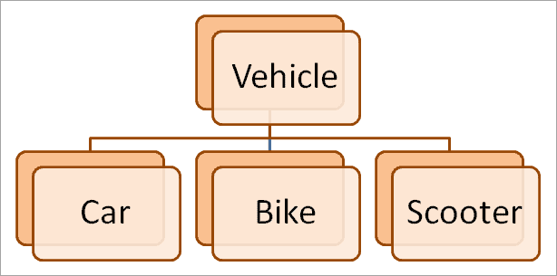
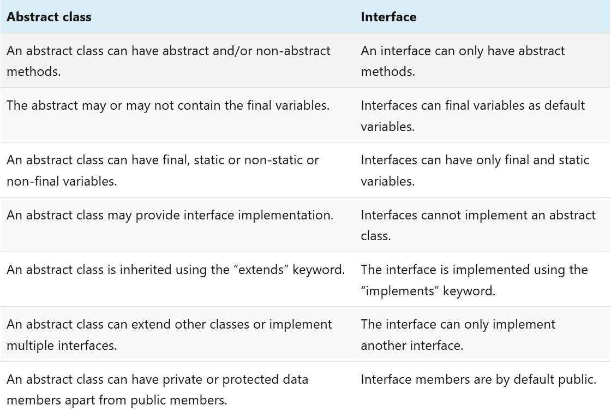
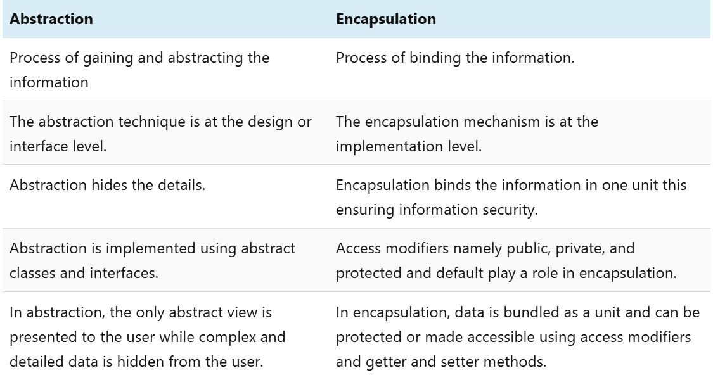

== Abstraction In Java
---
=== What Is Abstraction In Java?

The first pillar of OOP is “Abstraction”. “Abstraction is the process of selecting data to show only the relevant information to the user.”

In simple terms, abstraction “displays” only the relevant attributes of objects and “hides” the unnecessary details.

Abstraction in OOP can be of two types.

*1) Data Abstraction*

In data abstraction, we mostly create complex data types and hide their implementation. We only expose the operations to manipulate these data types without going into the details of their implementation.

One advantage of this approach is that we can change the implementation anytime without changing the behavior that is exposed to the user.

*2) Control Abstraction*

Control abstraction collects all the control statements that are a part of the application and exposes them as a unit. This feature is used when we have to perform a working feature using this control unit.

Control abstraction forms the main unit of structured programming and using control abstraction we can define simple functions in complex frameworks.

[,java]
----
//abstract class
abstract class Car{
    abstract void accelerate();
}
//concrete class
class Suzuki extends Car{
    void accelerate(){
        System.out.println(&amp;quot;Suzuki::accelerate&amp;quot;);
 
    }
}
class Main{
    public static void main(String args[]){
        Car obj = new Suzuki();    //Car object =&amp;gt;contents of Suzuki
        obj.accelerate();          //call the method
    }
}
----

=== What Is Java Abstract Class?
An abstract class can be defined as a class declared with the keyword “abstract” and has a restriction that it cannot be instantiated.

An abstract class may or may not have any abstract method (a method with no implementation). As far as JVM is concerned, an abstract class is an incomplete class that does not have a complete behavior.

In a nutshell, an abstract class can be described as shown below.

image::img3.png[]

=== Abstract Method In Java
An abstract method is a method preceded by an ‘abstract’ keyword without any implementation. An abstract method is declared inside an abstract class.

An abstract method is the one that makes a class incomplete as it doesn’t have an implementation. Hence when we include an abstract method in the class, naturally the class becomes incomplete.

We can use the abstract method by implementing it in a subclass i.e. a class inherits the abstract class and then implements or provides the code for all the abstract methods declared in the abstract class by overriding them.

Thus it becomes compulsory to override the abstract method in the subclass. If the abstract method is not implemented in the subclass as well, then we have to declare the subclass also as “abstract”.

=== What Is The Use Of An Abstract Class In Java
Let’s consider an example of Vehicles. We know that Vehicles can be of many types. We can have Cars, Scooters, bikes, mopeds, buses, etc. Though there are many types of vehicles, they have some properties or attributes that are common to all vehicles irrespective of their types.

For example, if a person is driving a car, what he/she will be interested in is just to start and stop the vehicle or accelerate or brake the vehicle. He/she will not be interested in knowing how the vehicle starts or stop. We are only interested in the abstract working of the functions and not in their details.

To begin with, we declare an abstract class “Vehicle”.

So we will have an abstract class Vehicle and there will be a concrete class representing each model of the vehicle. For illustration purposes, we have used only three models i.e. car, bike, and scooter.

[,java]
----
abstract class Vehicle{
    abstract void start () ;
    abstract void stop ();
    abstract void accelerate ();
    abstract void brake ();
}
 
class Car extends Vehicle{
    void start () { //code here…}
    void stop () { //code here…}
    void accelerate () { //code here…}
    void brake () { //code here…}
}
class Bike extends Vehicle{
    void start () { //code here…}
    void stop () { //code here…}
    void accelerate () { //code here…}
    void brake () { //code here…}
}
class Scooter extends Vehicle{
    void start () { //code here…}
    void stop () { //code here…}
    void accelerate () { //code here…}
    void brake () { //code here…}
}
----

So we will have a Vehicle abstract class and three classes Car, Bike, and Scooter. Each of these classes will extend the Vehicle class and override each of the abstract methods.

Thus in general, whenever we have to represent such a system that has common methods or operations to represent, then to present only the outer perspective to the user, we go for abstraction. As a result, we take out the common methods represent them as abstract methods, and collect these abstract methods in a common abstract class.

Once we have the outline of a system represented as an abstract class and the operations as abstract methods, we can then derive any number of classes from the given abstract class and override the abstract methods to implement these operations for each class.

This way it becomes useful to design a system.

=== Abstract Class And Interface
Interfaces are yet other building blocks that implement abstraction. Interfaces are contracts, and classes implementing the interface have to honor these contracts.

Contracts in interfaces are nothing but methods that are not implemented. Inside interfaces, we will only have method prototypes. There will not be a single implementation of methods inside interfaces.

=== Difference Between Abstract Class And Interface

=== When To Use Abstract Class And Interface In Java
There are two aspects that we have to consider 

*Abstract Classes With Partial Behavior*

We know that abstract classes may not be completely implemented. They can have partial behavior. On the other hand, interfaces do not have any implementation. So when we have to choose between an abstract class and an implementation, then we need to consider this aspect of our application.

This means that we have to first decide whether the application that we are designing has any common partial implementation that we can separate in an abstract class.

For example, consider that we are designing a web application. For this, we will have to use some web technology like Servlet, REST API, etc. Now each of these web technologies has some techniques or steps that are to be implemented irrespective of the application that we are developing. Then we build our customized application.

So in this case, the definite code that the web technology has to execute can be put in an abstract class. Can we have an interface for this? No. This is because the interface cannot have an implementation.

*Contract Only Interfaces*

We know that interfaces have contracts or methods that are a part of them. These methods are only prototypes. We have to implement these interfaces in a class and then override the methods.

Now consider the Map interface of Java Collections Framework. Many classes like HashMap, TreeMap, HashTable, etc. implement this interface. Each of these classes has a different implementation. They do not have any common behavior that can be represented in the abstract class.

So what we do is we design an interface with method prototypes and then implement each of the classes.

This way we should weigh each factor properly before we choose between an abstract class and an interface.

